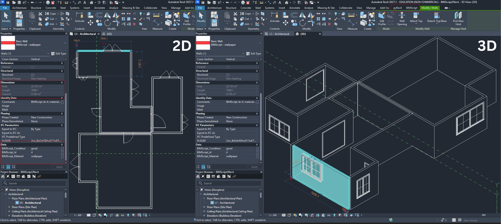

# BIMScript2Revit

A [pyRevit](https://github.com/pyrevitlabs/pyRevit) plugin that deterministically converts a
**BIMScript** program — a flat, text-based description of walls, doors and windows — into
**native Revit elements**, then exports the model to **IFC4** through Revit's own installed IFC
exporter, with a custom `BIMScript_Properties` property set carrying each element's provenance.



*One `scene100_material.txt` program (28 commands) imported as 18 walls, 3 doors and 7 windows.
The Properties palette shows the selected wall carrying `BIMScript_Id = 4`,
`BIMScript_Material = wallpaper`, `BIMScript_Condition = good` — the same values that reach the
exported IFC file.*

---

## What it does

```
BIMScript program  →  native Revit elements  →  IFC4 (+ audit sidecar)
   (text)              (Wall / FamilyInstance)   (Revit's IFC exporter)
```

1. **Parses** a BIMScript program (pure Python, no dependencies).
2. **Validates** it into a geometric *BuildPlan* in metres — every geometric and semantic
   decision happens here, on a platform-independent, unit-tested layer.
3. **Executes** that plan in Revit: real `DB.Wall` elements and real wall-hosted
   `DB.FamilyInstance` doors and windows, with per-material wall types and shared parameters.
4. **Exports** the document to IFC4 via `Document.Export`, letting Revit's maintained exporter
   own all IFC geometry and relationship serialisation.
5. **Records** an auditable JSON sidecar mapping every BIMScript id → Revit ElementId/UniqueId →
   IFC GUID, and runs a zero-dependency structural scan over the result.

This is deliberately described as **schema translation**, not "no translation". The plugin makes
the transformation explicit and auditable. It does **not** ask an LLM to choose Revit or IFC
classes — the learned model's job ends when the BIMScript text is produced; everything after
that is deterministic software.

## What is a BIMScript program?

A plain-text file, one command per line, comma-separated `key=value` parameters. All lengths are
in metres. Three commands are supported:

```
make_wall,   id=<int>, a_x=, a_y=, a_z=, b_x=, b_y=, b_z=, height=, thickness=
             [, material=<name>, condition=<name>]

make_door,   id=<int>, wall0_id=<int>, wall1_id=<int>,
             position_x=, position_y=, position_z=, width=, height=
             [, material=<name>, condition=<name>]

make_window, id=<int>, wall0_id=<int>, wall1_id=<int>,
             position_x=, position_y=, position_z=, width=, height=
             [, material=<name>, condition=<name>]
```

Lines from [`samples/scene100_material.txt`](samples/scene100_material.txt), with the
coordinates shortened for readability:

```
make_wall, id=4, a_x=-2.523, a_y=13.365, a_z=0.0, b_x=4.477, b_y=13.365, b_z=0.0, height=3.438, thickness=0.0, material=wallpaper, condition=good
make_door, id=1000, wall0_id=1, wall1_id=11, position_x=7.181, position_y=4.239, position_z=0.972, width=1.784, height=1.943, material=composite, condition=good
```

That wall is 7.00 m long; that door names two candidate hosts and is placed in wall `1`.

### Conventions

| Rule | Meaning |
|---|---|
| `a` / `b` | Wall endpoints on the **floor line**; `a_z` is the wall base elevation |
| `position_*` | Opening **centre**, so `sill = position_z − height/2 − wall_base` |
| `wall0_id` / `wall1_id` | Candidate host walls; `-1` means "none". The first that exists wins |
| `thickness=0.0` | Treated as *unspecified* → a 0.1 m default is applied |
| `material` / `condition` | Optional. Out-of-vocabulary or missing values normalise to `unknown` |

**Materials:** `aluminum`, `brick`, `composite`, `concrete`, `glass`, `metal`,
`painted_plaster`, `pvc`, `stone`, `tile`, `wallpaper`, `wood`, `wood_paneling`, `unknown`

**Conditions:** `new`, `good`, `worn`, `damaged`, `unknown`

The parser is intentionally forgiving: a malformed or unknown line is **skipped with a warning**
rather than aborting the import, because programs may come from an imperfect generative model.

## Mapping contract

| BIMScript | Native Revit | IFC result |
|---|---|---|
| `make_wall` | `DB.Wall`, category Walls, per-material wall type | `IfcWall` |
| `make_door` | wall-hosted `DB.FamilyInstance`, category Doors | `IfcDoor` + exporter-generated opening |
| `make_window` | wall-hosted `DB.FamilyInstance`, category Windows | `IfcWindow` + exporter-generated opening |
| `material=…` | wall core-layer material + `BIMScript_Material` | `BIMScript_Properties.BIMScript_Material` |
| `condition=…` | `BIMScript_Condition` shared parameter | `BIMScript_Properties.BIMScript_Condition` |
| `id=…` | `BIMScript_Id` shared parameter (+ Comments fallback) | `BIMScript_Properties.BIMScript_Id` |

Deterministic does **not** mean lossless. Revit family availability, family parameter
conventions, exporter version and the chosen IFC model view all affect the serialised result —
see [Known limitations](#known-limitations).

## Installation

**Requirements:** Windows, Revit 2021+ (developed and verified on **Revit 2027**, build
27.1.0.45), and pyRevit CE.

1. Install [pyRevit CE](https://github.com/pyrevitlabs/pyRevit/releases).
2. Clone this repository to the Windows machine.
3. In **pyRevit → Settings → Custom Extension Directories**, add the folder that *contains*
   `BIMScript.extension` (i.e. the repository root), then **Reload pyRevit**.
4. A **BIMScript** tab appears in the Revit ribbon.

## Usage

1. Create a project from the **metric Architectural template**.
2. **Load a door family and a window family** (e.g. `M_Single-Flush`, `M_Fixed`). Without them,
   openings are skipped with a warning — walls still import.
3. Click **BIMScript → Import BIMScript** and pick a program `.txt`.
4. Accept the IFC prompt and choose an output `.ifc` path.

The IFC export runs in a **separate transaction** from the model import, so a failed export never
rolls back geometry you already created.

Expected result for the bundled sample: **18 walls, 3 doors, 7 windows**.

### Output artifacts

Alongside `<name>.ifc` you get `<name>.ifc.bimscript.json`, recording:

- source filename and SHA-256;
- planned vs. actually-created element counts;
- per element: BIMScript id → Revit ElementId/UniqueId → IFC GUID → intended IFC class;
- the exact exporter options and schema requested;
- structural-scan results and their stated limitations.

Re-run that scan any time, without Revit:

```bash
python validate_ifc.py scene.ifc --manifest scene.ifc.bimscript.json
```

## Development without Revit

Parsing, validation, the mapping contract, the manifest and the IFC scan are all
Revit-independent and run on any platform under CPython 3 (and stay IronPython 2.7-compatible
for Revit's engine):

```bash
python -m unittest discover tests      # 31 tests
python dryrun.py samples/scene100_material.txt
python dryrun.py samples/scene100_material.txt \
  --json build_plan.json \
  --ifc-manifest ifc_mapping.json \
  --ifc-pset BIMScript_Properties.txt
```

`dryrun.py` uses the same parser, BuildPlan and IFC mapping contract as the ribbon button, so you
can inspect exactly what *would* be built before touching Revit.

Only element creation and `Document.Export` require Windows + Revit.

---

## Implementation notes on Revit IFC export

Most of the difficulty in this project was not geometry — it was getting a **custom property set
into the exported IFC**. The findings below are not clearly documented anywhere, and are recorded
here in the hope of saving someone else the time. All were verified empirically against Revit
2027 (27.1.0.45) by driving Revit headlessly with `pyrevit run` and by reading Autodesk's
open-source [revit-ifc](https://github.com/Autodesk/revit-ifc) exporter source (branch
`Release_27.x.x`).

### 1. `ExportUserDefinedPsetsFileName` is ignored on current Revit builds

The widely documented approach is a tab-delimited text file passed via:

```python
options.AddOption("ExportUserDefinedPsets", "true")
options.AddOption("ExportUserDefinedPsetsFileName", r"C:\path\Pset.txt")
```

In `ExporterInitializer.InitUserDefinedPropertySets`, the exporter branches:

```csharp
if (!OptionsUtil.UseLegacyParameterMapping())
   CollectUserDefinedDescriptionsFromDocument(...);   // ignores the .txt entirely
else
   CollectUserDefinedDescriptionsFromTxt(...);        // reads the .txt
```

`UseLegacyParameterMapping()` probes Revit's own native `IFCExportOptions.Assign()` behaviour —
**it is not controllable through any exported option**. On Revit 2027 it returns `false`, so the
`.txt` file is never read, and no error or warning is raised. The export simply contains no
custom properties.

### 2. `IFCParameterTemplate` is *not* the store the exporter reads

The obvious next guess — the newer `Autodesk.Revit.DB.IFCParameterTemplate` API — is a dead end
for this purpose. A template can be created, fully populated, flagged for export and set active,
and the exported IFC will still contain nothing. In the exporter source the resolved template is
only consulted by `ExcludeNotExportingPropertySets` — a *filtering* step, not the source of
definitions.

Two further traps:

- `IFCParameterTemplate.ImportFromFile()` expects Revit's **own** template format
  (`##Version:` / `##PropertySetup:` / `##PropertySet:`, UTF-16), *not* the legacy
  `PropertySet:` format. Feeding it the legacy file **succeeds silently and imports nothing**.
- Passing `AddOption("PropertyMapping", "<template name>")` makes the exporter read *all* of its
  property-set flags from that template, **overriding** the named options you set yourself.

### 3. What actually works: `IFCUserDefinedPropertySet`

Custom property sets live in a document-level store, `Autodesk.Revit.DB.IFCUserDefinedPropertySet`
(note: `Autodesk.Revit.DB`, **not** `Autodesk.Revit.DB.IFC`). Inside a transaction:

```python
store = DB.IFCUserDefinedPropertySet
pset = store.FindPropertySetByName(doc, "BIMScript_Properties")
if pset is None:
    pset = store.Create(doc, "BIMScript_Properties")
else:
    pset.ClearPropertySet()

entities = List[str]()
for name in ("IfcWall", "IfcDoor", "IfcWindow"):
    entities.Add(name)
pset.SetApplicableEntities(entities)

# ctor: (ifcPropertyName, revitPropertyId, revitPropertyName,
#        dataType, IFCUserDefinedPropertyType, dataTypeDefined)
pset.AddProperty(DB.IFCUserDefinedProperty(
    "BIMScript_Id", shared_param_element_id, "BIMScript_Id",
    "Text", DB.IFCUserDefinedPropertyType.Single, ""))
```

Note that `dataType` is the **string** `"Text"`, while `IFCUserDefinedPropertyType` is the *value
kind* (`Single`, `Bounded`, `List`, `Table`) and has no `Text` member. Then export with
`ExportUserDefinedPsets = "true"` and **no** `PropertyMapping` option.

### 4. Do not prefix custom property sets with `Pset_`

`Pset_` is reserved by buildingSMART for standard property sets. A custom set named
`Pset_BIMScript` is accepted by Revit and is schema-valid, but the official
[buildingSMART Validation Service](https://validate.buildingsmart.org) rejects it under rule
**PSE001**. Hence `BIMScript_Properties`.

### 5. IFC4 Reference View drops things you may be checking for

Exporting as `IFCVersion.IFC4RV` produces **no `IfcElementQuantity`** (even with
`ExportBaseQuantities = True`) and does not reliably preserve
`IfcRelVoidsElement` / `IfcRelFillsElement`. If you need to validate quantities or opening
relationships, export as plain `IFCVersion.IFC4` as well. The bundled scanner relaxes the
void/fill checks for Reference View exports and stays strict for plain IFC4.

### 6. Useful references

- [Revit API IFC export guide](https://help.autodesk.com/cloudhelp/2024/ENU/Revit-API/files/Revit_API_Developers_Guide/Advanced_Topics/Export/Revit_API_Revit_API_Developers_Guide_Advanced_Topics_Export_IFC_Export_html.html)
  — `Document.Export(folder, name, IFCExportOptions)`
- [Export User Defined Properties to IFC](https://help.autodesk.com/cloudhelp/2027/ENU/RevitLT-DocumentPresent/files/GUID-0968B3FF-832B-4155-8B36-E848ACC97B95.htm)
  — the legacy `.txt` format (see caveat 1)
- [Autodesk/revit-ifc](https://github.com/Autodesk/revit-ifc) — the exporter source; when
  documentation and behaviour disagree, this is the authority
- [buildingSMART Validation Service](https://validate.buildingsmart.org)

> **Tip:** `pyrevit run <absolute-script-path> --revit=<year>` runs a script inside Revit
> headlessly and is invaluable for probing API behaviour. Pass an **absolute** path — Revit's
> working directory is its own temp folder — and note that it cannot start while Revit is
> already open.

## Verification

The bundled scanner (`validate_ifc.py`) is a deliberately conservative **lexical** STEP scan. It
confirms the schema, minimum class counts, the custom property names, opening relations, stored
GUIDs, and that every planned element was actually created. It is **not** a schema validator —
use an independent validator and viewer before making formal claims about an export.

For the sample scene on Revit 2027 the exported IFC passes **STEP syntax** and **IFC schema**
validation on the buildingSMART service, with `BIMScript_Properties` attached to all 28 elements
(18 `IfcWall`, 3 `IfcDoor`, 7 `IfcWindow`).

That service also reports normative-rule findings that originate in **Revit's exporter**, not in
this adapter, and that affect any Revit IFC4 export:

| Rule | Finding | Origin |
|---|---|---|
| OJT001 | `IfcDoor.PredefinedType=DOOR`, `IfcWindow.PredefinedType=WINDOW` | Revit exporter |
| BLT002 | `IfcWindow.PartitioningType=NOTDEFINED` | Revit exporter |
| IFC102 | `IfcWallType.PredefinedType=STANDARD` (deprecated in IFC4) | Revit exporter |
| GRF003 | no `IfcProjectedCRS` (warning) | georeferencing not implemented |

This adapter never writes those attributes. Correcting them would mean post-editing the
exporter's output, which would defeat the point of letting Revit's maintained exporter own IFC
serialisation.

## Known limitations

- **Families are required.** Door/window import needs an architectural door and window family
  loaded in the project; otherwise those elements are skipped with a warning.
- **Sizing is best-effort.** The adapter duplicates a loaded family type and sets `Width` /
  `Height` type parameters. Families without them keep their default size and warn.
- **Wall thickness** is recorded in the BuildPlan but not yet reflected in distinct Revit wall
  types — wall types are currently grouped by material only.
- **Scope** is `make_wall` / `make_door` / `make_window` only.
- **The whole document is exported.** The scanner uses minimum counts so pre-existing elements
  do not cause false failures — but use a clean project for count experiments.
- **Placement** is relative to the project origin on the lowest level; shared-site, storey and
  georeferencing mappings are not implemented.
- **Materials:** wall core layers get real Revit materials; door/window material is guaranteed
  only as `BIMScript_Properties.BIMScript_Material` unless the family exposes a compatible
  material parameter.
- **Document side effects:** the import adds shared parameters, materials, wall types and a
  `BIMScript_Properties` definition to the document, overwriting an existing definition of the
  same name.
- **`ifc/BIMScript_Properties.txt`** is consumed only by the legacy code path (see note 1). It is
  kept as the auditable declaration of the mapping and for older Revit versions.

## Troubleshooting

| Symptom | Cause / response |
|---|---|
| No BIMScript tab | Register the folder *containing* `BIMScript.extension`, then reload pyRevit |
| Doors/windows skipped | Load an architectural door/window family into the project |
| `BIMScript_*` only in Comments | Shared-parameter binding failed; IFC property validation will likely fail too — keep the warning |
| IFC export fails, Revit model intact | Expected isolation. Check exporter installation, output-path permissions, and the pyRevit log |
| IFC written but scan fails | Inspect the failed checks in the sidecar before using the file |
| Unexpected extra IFC elements | Export is document-wide; use a clean project |
| `packaged Pset definition was missing` | Harmless: the plugin regenerated it from `bimscript_core/ifc.py`, which is the source of truth |

## Repository layout

```text
bimscript_core/          platform-independent core (unit-tested, no Revit)
  parser.py              BIMScript command parser
  plan.py                validation + geometric BuildPlan (metres)
  taxonomy.py            material / condition vocabularies and colours
  ifc.py                 IFC class + property-set contract, manifest, scanner
BIMScript.extension/     pyRevit extension (thin Revit executor)
ifc/                     user-defined property-set declaration
samples/                 example BIMScript program
tests/                   31 unit tests
dryrun.py                preview a BuildPlan without Revit
validate_ifc.py          standalone post-export structural scan
```

## License

[MIT](LICENSE) © 2026 Prakash Naikade
